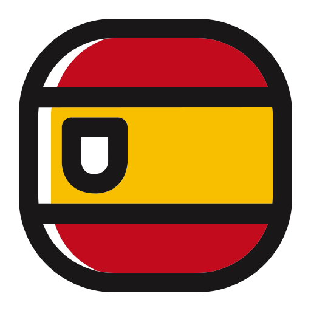

```{r setup, include=FALSE}
knitr::opts_chunk$set(echo = TRUE)

library(DT)
library(dplyr)
library(knitr)
library(readxl)
library(glue)

dir <- "C:/Users/Ai Kimoto/Documents/GitHub/iccat-mse-web/"
txtref = data.frame(read_excel(paste0(dir,"ICCAT MSE Web TEXT_read.xlsx"), sheet = "references", col_names = TRUE))
txt = read_excel(paste0(dir,"ICCAT MSE Web TEXT_read.xlsx"), sheet = "NALB", col_names = TRUE)

txtref$Links <- paste0(
  #ENG
  paste0('<a href="', txtref$ENGlink, '" target="_blank">',  '</a>'),
  #FRA
  ifelse(is.na(txtref$FRAlink),"",paste0('<a href="', txtref$FRAlink, '" target="_blank">',  '</a>')),
  #ESP
  ifelse(is.na(txtref$ESPlink),"",paste0('<a href="', txtref$ESPlink, '" target="_blank">',  '</a>'))
)

lg <- 1

refs <- txtref[,c(1:5,9)]
#refs2 <- txtref[txtref$Item=="Rec/Res",c(2:5,9)]

```


ENG/FRA/ESP {data-orientation=rows}
=====================================  

Column {.sidebar}
-----------------------------------------------------------------------

<!-- Column 1 -->
<div>
  <strong>`r {na.omit(txt[txt$item=="Title1",lg+2])}`</strong><br/>
  <a href="#Top">Top</a><br/>
  <a href="#Materials">References chose</a><br/>

</div>

<hr/>

<!-- Column 2 -->
<div>
  <strong>`r {na.omit(txt[txt$item=="Title11",lg+2])}`</strong><br/>
  <a href=`r {na.omit(txt[txt$item=="gen_link",lg+2])}`>
    `r {na.omit(txt[txt$item=="gen",lg+2])}`</a><br/>
  <a href=`r {na.omit(txt[txt$item=="sp1_link",lg+2])}`>
    `r {na.omit(txt[txt$item=="sp1",lg+2])}`</a><br/>
  <a href=`r {na.omit(txt[txt$item=="sp2_link",lg+2])}`>
    `r {na.omit(txt[txt$item=="sp2",lg+2])}`</a><br/>
  <a href=`r {na.omit(txt[txt$item=="sp3_link",lg+2])}`>
    `r {na.omit(txt[txt$item=="sp3",lg+2])}`</a><br/>
  <a href=`r {na.omit(txt[txt$item=="sp4_link",lg+2])}`>
    `r {na.omit(txt[txt$item=="sp4",lg+2])}`</a><br/>
  <a href=`r {na.omit(txt[txt$item=="sp5_link",lg+2])}`>
    `r {na.omit(txt[txt$item=="sp5",lg+2])}`</a><br/>
  <a href=`r {na.omit(txt[txt$item=="sp6_link",lg+2])}`>
    `r {na.omit(txt[txt$item=="sp6",lg+2])}`</a><br/>
</div>


```{css, echo=FALSE}
/* Set sidebar background and text colors */
nav.section.sidebar {
  background-color: #001A3E !important;  /* dark blue */
  color: #ffffff !important;
}

/* Make sidebar links white */
nav.section.sidebar a {
  color: #ffffff !important;
}

/* Optional: make section headers (like Inputs) white too */
nav.section.sidebar h3 {
  color: #ffffff !important;
```

```{css, echo=FALSE}

.section.level3 {
  margin: 0 !important;
  padding: 0 !important;
}

.chart-stage {
  margin: 0 !important;
  padding: 0 !important;
}

.chart-wrapper {
  margin: 0 !important;
  padding: 0 !important;
}

.chart-stage,
.chart-wrapper,
.section.level3 {
  border: none !important;
  box-shadow: none !important;}


.chart-stage {
  background-color: #ffffff !important;  
}


```

Row {data-height=300}
-------------------------------------
   
###  {#Top} 
```{r echo=FALSE, results='asis'}
#Reference title

cat(glue('
<div style="background-color:#001A3E; padding:4px; text-align: center;">
  <h1 style= "font-size:2em; color:#ffffff; font-weight: bold;"> 
      {na.omit(txt[txt$item=="Title10",1+2])}/
      {na.omit(txt[txt$item=="Title10",2+2])}/
      {na.omit(txt[txt$item=="Title10",3+2])}</h1>
</div>

<div style="background-color:#ffffff; padding:10px 30px; text-align: center;">
  <h2 style= "font-size:1.4em; color:#001A3E;"> 
      {na.omit(txt[txt$item=="note1",1+2])}<br>

      {na.omit(txt[txt$item=="note1",2+2])}<br>

      {na.omit(txt[txt$item=="note1",3+2])}</h2>
</div>

'))

``` 

Row {data-height=300}
-------------------------------------

###  {#Materials} 
```{r echo=FALSE, results='asis'}
#Materials title

cat(glue('
<div style="background-color:#001A3E; padding:4px; text-align: center;">
  <h1 style= "font-size:2em; color:#ffffff; font-weight: bold;"> 
      {na.omit(txt[txt$item=="ref1",1+2])}/
      {na.omit(txt[txt$item=="ref1",2+2])}/
      {na.omit(txt[txt$item=="ref1",3+2])}</h1>
</div>

<div style="background-color:#ffffff; padding:10px 30px; text-align: center;">
  <h2 style= "font-size:1.4em; color:#001A3E;"> 
      {na.omit(txt[txt$item=="note2",1+2])}<br>

      {na.omit(txt[txt$item=="note2",2+2])}<br>

      {na.omit(txt[txt$item=="note2",3+2])}</h2>
</div>

'))

``` 


Row {data-height=auto}
-------------------------------------
### 
```{r echo=FALSE, results='asis'}

#Materials
datatable(
  refs,
  escape = FALSE,
  filter = "top",
  options = list(
    pageLength = nrow(refs),
    scrollY = "400px",
    scrollCollapse = TRUE,
    autoWidth = FALSE,
    lengthChange = FALSE,  
    columnDefs = list(
      list(width = '50px', targets = 0),  
      list(width = '50px', targets = 1),  
      list(width = '50px', targets = 2),  
      list(width = '100px', targets = 3),  
      list(width = '300px', targets = 4),  
      list(width = '80px', targets = 5),  
      list(className = 'dt-left', targets = "_all")
    ),
    initComplete = JS(
      "function(settings, json) {",
      "  var api = this.api();",
      "  api.columns().every(function(i) {",
      "    if ([0, 1, 2].includes(i)) {",
      "      var column = this;",
      "      var select = $('<select><option value=\"\"></option></select>')",
      "        .appendTo($(column.header()).empty())",
      "        .on('change', function () {",
      "          var val = $.fn.dataTable.util.escapeRegex($(this).val());",
      "          column.search(val ? '^' + val + '$' : '', true, false).draw();",
      "        });",
      "      column.data().unique().sort().each(function (d) {",
      "        select.append('<option value=\"' + d + '\">' + d + '</option>');",
      "      });",
      "    }",
      "  });",
      "}"
    )
  ),
  rownames = FALSE
)


```   


