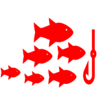

```{r setup, include=FALSE}
knitr::opts_chunk$set(echo = TRUE)
library(knitr)
library(readxl)

txt = read_excel(paste0(dir,"ICCAT MSE Web TEXT_read.xlsx"), sheet = sp, col_names = TRUE)

library(glue)

txt$ENG <- gsub("\r\n", "<br>", txt$ENG)
txt$FRA <- gsub("\r\n", "<br>", txt$FRA)
txt$ESP <- gsub("\r\n", "<br>", txt$ESP)

```


ENG {data-orientation=rows}
=====================================  

```{r echo=FALSE, results='asis'}
#ACTION, need to chose language and change the references e.g.#OM...

#chose language
lg <- 1 #1:ENG, 2:FRA, 3:ESP
lg2 <- c("ENG", "FRA", "ESP")[lg]

#decide space ..mannually decided in Excel.
rowH1 <- as.integer(na.omit(txt[txt$item=="rowH1",lg+2])) 
rowH2 <- as.integer(na.omit(txt[txt$item=="rowH2",lg+2])) 
rowH3 <- as.integer(na.omit(txt[txt$item=="rowH3",lg+2])) 
rowH4 <- as.integer(na.omit(txt[txt$item=="rowH4",lg+2])) 
rowH5 <- as.integer(na.omit(txt[txt$item=="rowH5",lg+2])) 
rowH6 <- as.integer(na.omit(txt[txt$item=="rowH6",lg+2])) 
rowH7 <- as.integer(na.omit(txt[txt$item=="rowH7",lg+2])) 
rowH8 <- as.integer(na.omit(txt[txt$item=="rowH8",lg+2])) 

```

Column {.sidebar}
-----------------------------------------------------------------------

<!-- Column 1 -->
<div>
  <strong>`r {na.omit(txt[txt$item=="Title1",lg+2])}`</strong><br/>
  <a href="#Overview_eng">`r {na.omit(txt[txt$item=="Title2",lg+2])}`</a><br/>
  <a href="#History_eng">`r {na.omit(txt[txt$item=="Title3",lg+2])}`</a><br/>
  <a href="#Contents_eng">`r {na.omit(txt[txt$item=="Title4",lg+2])}`</a><br/>
  <a href="#OM_eng">`r {na.omit(txt[txt$item=="Title5",lg+2])}`</a><br/>
  <a href="#MO_eng">`r {na.omit(txt[txt$item=="Title6",lg+2])}`</a><br/>
  <a href="#CMP_eng">`r {na.omit(txt[txt$item=="Title7",lg+2])}`</a><br/>
  <a href="#MP_eng">`r {na.omit(txt[txt$item=="Title8",lg+2])}`</a><br/>
  <a href="#EC_eng">`r {na.omit(txt[txt$item=="Title9",lg+2])}`</a><br/>
  <a href="#References_eng">`r {na.omit(txt[txt$item=="Title10",lg+2])}`</a><br/>
</div>

<hr/>

<!-- Column 2 -->
<div>
  <strong>`r {na.omit(txt[txt$item=="Title11",lg+2])}`</strong><br/>
  <a href=`r {na.omit(txt[txt$item=="gen_link",lg+2])}`>
    `r {na.omit(txt[txt$item=="gen",lg+2])}`</a><br/>
  <a href=`r {na.omit(txt[txt$item=="sp1_link",lg+2])}`>
    `r {na.omit(txt[txt$item=="sp1",lg+2])}`</a><br/>
  <a href=`r {na.omit(txt[txt$item=="sp2_link",lg+2])}`>
    `r {na.omit(txt[txt$item=="sp2",lg+2])}`</a><br/>
  <a href=`r {na.omit(txt[txt$item=="sp3_link",lg+2])}`>
    `r {na.omit(txt[txt$item=="sp3",lg+2])}`</a><br/>
  <a href=`r {na.omit(txt[txt$item=="sp4_link",lg+2])}`>
    `r {na.omit(txt[txt$item=="sp4",lg+2])}`</a><br/>
  <a href=`r {na.omit(txt[txt$item=="sp5_link",lg+2])}`>
    `r {na.omit(txt[txt$item=="sp5",lg+2])}`</a><br/>
  <a href=`r {na.omit(txt[txt$item=="sp6_link",lg+2])}`>
    `r {na.omit(txt[txt$item=="sp6",lg+2])}`</a><br/>
</div>


```{css, echo=FALSE}
/* Set sidebar background and text colors */
nav.section.sidebar {
  background-color: #001A3E !important;  /* dark blue */
  color: #ffffff !important;
}

/* Make sidebar links white */
nav.section.sidebar a {
  color: #ffffff !important;
}

/* Optional: make section headers (like Inputs) white too */
nav.section.sidebar h3 {
  color: #ffffff !important;
```

```{css, echo=FALSE}

.section.level3 {
  margin: 0 !important;
  padding: 0 !important;
}

.chart-stage {
  margin: 0 !important;
  padding: 0 !important;
}

.chart-wrapper {
  margin: 0 !important;
  padding: 0 !important;
}

.chart-stage,
.chart-wrapper,
.section.level3 {
  border: none !important;
  box-shadow: none !important;}


.chart-stage {
  background-color: #001A3E !important;  
}


```

Row {data-height=`r rowH1`}
-------------------------------------
### 

```{r echo=FALSE, results='asis'}
#title and species image
cat(glue('
<div style="background-color:#001A3E; padding:0px; text-align: center;">
  <h1 style= "font-size:2.5em; color:#ffffff; font-weight: bold;">
      {na.omit(txt[txt$item=="Title1",lg+2])}</h1>
  <h2 style= "font-size:2em; color:#ffffff; font-weight: bold;">
      (<em>{na.omit(txt[txt$item=="sp_name",lg+2])}</em>)</h2>
  
</div>
'))

```

Row {data-height=75}
-------------------------------------
   
###  {#Overview_eng} 
```{r echo=FALSE, results='asis'}
#overview title

cat(glue('
<div style="background-color:#f8f2e2; padding:4px; text-align: center;">
  <h1 style= "font-size:2em; color:#001A3E; font-weight: bold;"> 
      {na.omit(txt[txt$item=="Title2",lg+2])}</h1>
</div>
'))

``` 

Row {data-height=`r rowH2`}
-------------------------------------
### 

```{r echo=FALSE, results='asis'}
#overview text

cat(glue('
<div style="background-color:#001A3E; padding:10px 50px; text-align: justify; line-height: 1.8; letter-spacing: 0.3px;">
  <h2 style= "font-size:1.5em; color:#ffffff; ">
      {na.omit(txt[txt$item=="Overview",lg+2])} </h2>
</div>
'))

```   


Row {data-height=270}
-------------------------------------
### {data-width=23%}

### {data-width=18%}
```{r echo=FALSE, results='asis'}
#Overview OM develptment

cat(glue('
<div style="background-color:#001A3E; padding:10px; text-align: center;">
  <h2 style="font-size:1.5em; color:#ffffff; ">
      {na.omit(txt[txt$item=="omcm1",lg+2])}</h2>
  
  <h2 style="font-size:1.5em; color:#ffffff; ">
      {na.omit(txt[txt$item=="omcm2",lg+2])}</h2>
</div>
'))

```

### {data-width=18%}
    
```{r echo=FALSE, results='asis'}
#Overview MP adoption 
cat(glue('
<div style="background-color:#001A3E; padding:10px; text-align: center;">
  <h2 style="font-size:1.5em; color:#ffffff;">
      {na.omit(txt[txt$item=="mpcm1",lg+2])}</h2>
  
  <h2 style="font-size:1.5em; color:#ffffff; ">
      {na.omit(txt[txt$item=="mpcm2",lg+2])}</h2>
</div>
'))

```

### {data-width=18%}
    
```{r echo=FALSE, results='asis'}
#Overview ECP adoption
cat(glue('
<div style="background-color:#001A3E; padding:10px; text-align: center;">
  <h2 style="font-size:1.5em; color:#ffffff; ">
      {na.omit(txt[txt$item=="ecpcm1",lg+2])}</h2>
  
  <h2 style="font-size:1.5em; color:#ffffff; ">
      {na.omit(txt[txt$item=="ecpcm2",lg+2])}</h2>
</div>
'))

```
### {data-width=23%}


Row {data-height=75}
-------------------------------------
   
###  {#History_eng} 
```{r echo=FALSE, results='asis'}
#History title

cat(glue('
<div style="background-color:#f8f2e2; padding:4px; text-align: center;">
  <h1 style= "font-size:2em; color:#001A3E; font-weight: bold;"> 
      {na.omit(txt[txt$item=="Title3",lg+2])}</h1>
</div>
'))

``` 


Row {data-height=`r rowH3`}
-------------------------------------
### 

```{r echo=FALSE, results='asis'}
#History text 

cat(glue('
<div style="background-color:#001A3E; padding:10px 50px; text-align: justify; line-height: 1.6; letter-spacing: 0.3px;">

  <h2 style= "font-size:1.5em; color:#ffffff; ">
      {na.omit(txt[txt$item=="History",lg+2])} </h2>
</div>
'))

```


Row {data-height=75}
-------------------------------------
### {#Contents_eng}

```{r echo=FALSE, results='asis'}
#Contents title

cat(glue('
<div style="background-color:#f8f2e2; padding:4px 20px; text-align: center; line-height: 1.6; letter-spacing: 0.3px;">
  <h1 style= "font-size:2em; color:#001A3E; font-weight: bold;"> 
      {na.omit(txt[txt$item=="Title4",lg+2])}</h1>
</div>
'))

```

Row {data-height=230}
-------------------------------------

### {data-width=14%}  

### {data-width=12%}
```{r echo=FALSE, results='asis'}
#contents 1 (6)

cat(glue('
<div style="background-color:#001A3E; padding:10px; text-align: center;">
  <a href="#OM_eng" style="color: #ffffff;">
  </a>
  <h2 style="font-size:1.3em; color:#ffffff;">
      <a href="#OM_eng" style="color: #ffffff;">
      {na.omit(txt[txt$item=="Title5",lg+2])}</a></h2>
</div>
'))

```

### {data-width=12%}
```{r echo=FALSE, results='asis'}
#contents 2 (6)

cat(glue('
<div style="background-color:#001A3E; padding:10px; text-align: center;">
  <a href="#MO_eng" style="color: #ffffff;">
  </a>
  <h2 style="font-size:1.3em; color:#ffffff;">
      <a href="#MO_eng" style="color: #ffffff;">
      {na.omit(txt[txt$item=="Title6",lg+2])}</a></h2>
</div>
'))

```

### {data-width=12%}
```{r echo=FALSE, results='asis'}
#contents 3 (6)

cat(glue('
<div style="background-color:#001A3E; padding:10px; text-align: center;">
  <a href="#CMP_eng" style="color: #ffffff;">
  </a>
  <h2 style="font-size:1.3em; color:#ffffff;">
      <a href="#CMP_eng" style="color: #ffffff;">
      {na.omit(txt[txt$item=="Title7",lg+2])}</a></h2>
</div>
'))

```

### {data-width=12%}
```{r echo=FALSE, results='asis'}
#contents 4 (6)

cat(glue('
<div style="background-color:#001A3E; padding:10px; text-align: center;">
  <a href="#MP_eng" style="color: #ffffff;">
  </a>
  <h2 style="font-size:1.3em; color:#ffffff;">
      <a href="#MP_eng" style="color: #ffffff;">
      {na.omit(txt[txt$item=="Title8",lg+2])}</a></h2>
</div>
'))

```

### {data-width=12%}
```{r echo=FALSE, results='asis'}
#contents 5 (6)

cat(glue('
<div style="background-color:#001A3E; padding:10px; text-align: center;">
  <a href="#EC_eng" style="color: #ffffff;">
  </a>
  <h2 style="font-size:1.3em; color:#ffffff;">
      <a href="#EC_eng" style="color: #ffffff;">
      {na.omit(txt[txt$item=="Title9",lg+2])}</a></h2>
</div>
'))

```

### {data-width=12%}
```{r echo=FALSE, results='asis'}
#contents 6 (6)

cat(glue('
<div style="background-color:#001A3E; padding:10px; text-align: center;">
  <a href="#References_eng" style="color: #ffffff;">
  </a>
  <h2 style="font-size:1.3em; color:#ffffff;">
      <a href="#References_eng" style="color: #ffffff;">
      {na.omit(txt[txt$item=="Title10",lg+2])}</a></h2>
</div>
'))

```
### {data-width=14%} 


Row {data-height=75}
-------------------------------------
   
###  {#OM_eng}
```{r echo=FALSE, results='asis'}
#OM title

cat(glue('
<div style="background-color:#f8f2e2; padding:4px; text-align: center;">
  <h1 style= "font-size:2em; color:#001A3E; font-weight: bold;"> 
      {na.omit(txt[txt$item=="Title5",lg+2])}</h1>
</div>
'))

``` 

Row {data-height=`r rowH4`}
-------------------------------------
###    

```{r echo=FALSE, results='asis'}
#OM development

cat(glue('
<div style="background-color:#001A3E; padding:10px 50px; text-align: justify;">
  <h2 style= "font-size:1.5em; color:#ffffff; ">
      {na.omit(txt[txt$item=="OM",lg+2])}</h2>
</div>
'))

```   

Row {data-height=100}
-------------------------------------
   
###  
```{r echo=FALSE, results='asis'}
#row materials title

cat(glue('
<div style="background-color:#001A3E; padding:0px; text-align: center;">
  <h1 style= "font-size:1.8em; color:#ffffff;"> 
      {na.omit(txt[txt$item=="ref1",lg+2])}</h1>
  <h2 style= "font-size:1.4em; color:#ffffff;"> 
  <a href="#References_eng" style="color: #ffffff;">
      {na.omit(txt[txt$item=="ref1txt",lg+2])} </a> </h2>
</div>
'))

``` 


Row {data-height=150}
-------------------------------------

### {data-width=20%}  

### {data-width=12%}
```{r echo=FALSE, results='asis'}
#codes 1 (3)

cat(glue('
<div style="background-color:#001A3E; padding:0px; text-align: center;">
  <a href={na.omit(txt[txt$item=="OMref1",lg+2])} target="_blank" style="color: #ffffff;">
  </a>
  <h2 style="font-size:1.3em; color:#ffffff;">
  <a href={na.omit(txt[txt$item=="OMref1",lg+2])} style="color: #ffffff;">
    {na.omit(txt[txt$item=="OMref_txt1",lg+2])}</a></h2>
</div>
'))

```

### {data-width=12%}
```{r echo=FALSE, results='asis'}
#codes 2 (3)

cat(glue('
<div style="background-color:#001A3E; padding:0px; text-align: center;">
  <a href={na.omit(txt[txt$item=="OMref2",lg+2])} target="_blank" style="color: #ffffff;">
  </a>
  <h2 style="font-size:1.3em; color:#ffffff;">
  <a href={na.omit(txt[txt$item=="OMref2",lg+2])} target="_blank" style="color: #ffffff;">
      {na.omit(txt[txt$item=="OMref_txt2",lg+2])}</a></h2>
</div>
'))

```


### {data-width=12%}
```{r echo=FALSE, results='asis'}
#codes 3 (3)
#presentation links

cat(glue('
<div style="background-color:#001A3E; padding:0px; text-align: center;">
  <a href={na.omit(txt[txt$item=="OMref3",lg+2])} style="color: #ffffff;">
  </a>
  <h2 style="font-size:1.3em; color:#ffffff;">
  <a href={na.omit(txt[txt$item=="OMref3",lg+2])} style="color: #ffffff;">
      {na.omit(txt[txt$item=="OMref_txt3",lg+2])}</a></h2>
</div>
'))

```

### {data-width=20%} 


Row {data-height=120}
-------------------------------------
   
### {#MO_eng}
```{r echo=FALSE, results='asis'}
#Management Objectives title

cat(glue('
<div style="background-color:#f8f2e2; padding:4px; text-align: center;">
  <h1 style= "font-size:2em; color:#001A3E; font-weight: bold;"> 
      {na.omit(txt[txt$item=="Title6",lg+2])}</h1>
  <h1 style="font-size:2em; color:#001A3E; font-weight: bold;">
      {na.omit(txt[txt$item=="MO0",lg+2])}</h1>
</div>
'))

``` 

Row {data-height=270}
-------------------------------------

### {data-width=10%}  

### {data-width=20%}
```{r echo=FALSE, results='asis'}
#Management Objectives 1 (4)

cat(glue('

<div style="background-color:#001A3E; padding:10px; text-align: center; margin: 0px;">
  <h2 style="font-size:1.5em; color:#ffffff; font-weight: bold;">Stock Status</h2>
  
  <h2 style="font-size:1.5em; color:#ffffff;">
      {na.omit(txt[txt$item=="MO1",lg+2])}</h2>
</div>
'))

```

### {data-width=20%}
```{r echo=FALSE, results='asis'}
#Management Objectives 2 (4)

cat(glue('
<div style="background-color:#001A3E; padding:10px; text-align: center; margin: 0px;">
  <h2 style="font-size:1.5em; color:#ffffff; font-weight: bold;">Safety</h2>
  
  <h2 style="font-size:1.5em; color:#ffffff;">
      {na.omit(txt[txt$item=="MO2",lg+2])}</h2>
</div>
'))

```

### {data-width=20%}
```{r echo=FALSE, results='asis'}
#Management Objectives 3 (4)

cat(glue('
<div style="background-color:#001A3E; padding:10px; text-align: center; margin: 0px;">
  <h2 style="font-size:1.5em; color:#ffffff; font-weight: bold;">Yield</h2>
  
  <h2 style="font-size:1.5em; color:#ffffff;">
      {na.omit(txt[txt$item=="MO3",lg+2])}</h2>
</div>
'))

```

### {data-width=20%}
```{r echo=FALSE, results='asis'}
#Management Objectives 4 (4)

cat(glue('
<div style="background-color:#001A3E; padding:10px; text-align: center; margin: 0px;">
  <h2 style="font-size:1.5em; color:#ffffff; font-weight: bold;">Stability</h2>
  
  <h2 style="font-size:1.5em; color:#ffffff;">
      {na.omit(txt[txt$item=="MO4",lg+2])}</h2>
</div>
'))

```

### {data-width=10%} 


Row {data-height=75}
-------------------------------------
   
###  {#CMP_eng}
```{r echo=FALSE, results='asis'}
#CMP title

cat(glue('
<div style="background-color:#f8f2e2; padding:4px; text-align: center;">
  <h1 style= "font-size:2em; color:#001A3E; font-weight: bold;"> 
      {na.omit(txt[txt$item=="Title7",lg+2])}</h1>
</div>
'))

``` 

Row {data-height=`r rowH5`}
-------------------------------------
   
### 

```{r echo=FALSE, results='asis'}
#CMP text

cat(glue('
<div style="background-color:#001A3E; padding:10px; text-align: center;">
  <h2 style= "font-size:1.5em; color:#ffffff; ">
      {na.omit(txt[txt$item=="CMP",lg+2])}</h2>
</div>
'))

```   


Row {data-height=75}
-------------------------------------
   
###  {#MP_eng}
```{r echo=FALSE, results='asis'}
#MP title

cat(glue('
<div style="background-color:#f8f2e2; padding:4px; text-align: center;">
  <h1 style= "font-size:2em; color:#001A3E; font-weight: bold;"> 
      {na.omit(txt[txt$item=="Title8",lg+2])}</h1>
</div>
'))

``` 


Row {data-height=75}
-------------------------------------
### 

```{r echo=FALSE, results='asis'}
#MP text

cat(glue('
<div style="background-color:#001A3E; padding:10px 20px; text-align: center;">
  <h2 style= "font-size:1.5em; color:#ffffff; ">
      {na.omit(txt[txt$item=="MP",lg+2])}</h2>
</div>
'))

```   

Row {data-height=`r rowH6`}
-------------------------------------
### {data-width=5%}

### {data-width=70%}

```{r echo=FALSE, results='asis'}
#MP detail

cat(glue('
<div style="background-color:#001A3E; padding:10px 50px; text-align: justify;">
  <h2 style= "font-size:1.4em; color:#ffffff; ">
      {na.omit(txt[txt$item=="MP2",lg+2])}</h2>
</div>
'))

```   

### {data-width=25%}

```{r echo=FALSE, results='asis'}
#MP detail 

cat(glue('
<div style="background-color:#001A3E; padding:10px 20px; text-align: left;">
  <a href={na.omit(txt[txt$item=="MP1link",lg+2])} style="color: #ffffff;">
  </a>
  <h2 style= "font-size:1.3em; color:#ffffff; ">
  <a href={na.omit(txt[txt$item=="MP1link",lg+2])} style="color: #ffffff;">
      {na.omit(txt[txt$item=="MP1",lg+2])}</a></h2>
</div>
'))

```   


Row {data-height=75}
-------------------------------------
   
###  {#EC_eng}
```{r echo=FALSE, results='asis'}
#EC title

cat(glue('
<div style="background-color:#f8f2e2; padding:4px; text-align: center;">
  <h1 style= "font-size:2em; color:#001A3E; font-weight: bold;"> 
      {na.omit(txt[txt$item=="Title9",lg+2])}</h1>
</div>
'))

``` 

Row {data-height=`r rowH7`}
-------------------------------------
### 

```{r echo=FALSE, results='asis'}
#EC Text

cat(glue('
<div style="background-color:#001A3E; padding:10px 20px; text-align: center;">
  <h2 style= "font-size:1.5em; color:#ffffff; ">
      {na.omit(txt[txt$item=="EC1",lg+2])}</h2>
  <h2 style= "font-size:1.5em; color:#ffffff; ">
      {na.omit(txt[txt$item=="EC2",lg+2])}</h2>
</div>
'))

```   

Row {data-height=`r rowH8`}
-------------------------------------
### {data-width=5%}

### {data-width=70%}

```{r echo=FALSE, results='asis'}
#ECP detail

cat(glue('
<div style="background-color:#001A3E; padding:10px 30px; text-align: left;">
  <h2 style= "font-size:1.5em; color:#ffffff; font-weight: bold;">
      {na.omit(txt[txt$item=="ECP1",lg+2])}</h2>
  <h2 style= "font-size:1.3em; color:#ffffff;">{na.omit(txt[txt$item=="ECP2",lg+2])}</h2>
</div>
'))

```   

### {data-width=25%}

```{r echo=FALSE, results='asis'}
#ECP detail reference

cat(glue('
<div style="background-color:#001A3E; padding:10px 20px; text-align: left;">
  <a href= {na.omit(txt[txt$item=="ECP0link",lg+2])} style="color: #ffffff;">
  </a>
  <h2 style= "font-size:1.3em; color:#ffffff; ">
  <a href= {na.omit(txt[txt$item=="ECP0link",lg+2])} style="color: #ffffff;">
      {na.omit(txt[txt$item=="ECP0",lg+2])}</a></h2>
</div>
'))

```   

Row {data-height=70}
-------------------------------------
   
### {#References_eng}
```{r echo=FALSE, results='asis'}
#Reference title

cat(glue('
<div style="background-color:#f8f2e2; padding:5px; text-align: center;">
  <h1 style= "font-size:2em; color:#001A3E; font-weight: bold;"> 
      {na.omit(txt[txt$item=="Title10",lg+2])}</h1>
</div>
'))

``` 

Row {data-height=180}
-------------------------------------

### {data-width=15%}  

### {data-width=14%}
```{r echo=FALSE, results='asis'}
#References 1 (5)

cat(glue('

<div style="background-color:#001A3E; padding:20px 20px; text-align: center; margin: 0px;">
  
  <h2 style="font-size:1.5em; color:#ffffff;">
      {na.omit(txt[txt$item=="ref1",lg+2])}</h2>
</div>
'))

```

### {data-width=14%}
```{r echo=FALSE, results='asis'}
#References 2 (5)

cat(glue('

<div style="background-color:#001A3E; padding:20px 20px; text-align: center; margin: 0px;">
  
  <h2 style="font-size:1.5em; color:#ffffff;">
      {na.omit(txt[txt$item=="ref2",lg+2])}</h2>
</div>
'))

```

### {data-width=14%}
```{r echo=FALSE, results='asis'}
#References 3 (5)

cat(glue('
<div style="background-color:#001A3E; padding:20px 20px; text-align: center; margin: 0px;">
  
  <h2 style="font-size:1.5em; color:#ffffff;">
      {na.omit(txt[txt$item=="ref3",lg+2])}</h2>
</div>
'))

```

### {data-width=14%}
```{r echo=FALSE, results='asis'}
#References 4 (5)

cat(glue('
<div style="background-color:#001A3E; padding:20px 20px; text-align: center; margin: 0px;">
  
  <h2 style="font-size:1.5em; color:#ffffff;">
      {na.omit(txt[txt$item=="ref4",lg+2])}</h2>
</div>
'))

```

### {data-width=14%}
```{r echo=FALSE, results='asis'}
#References 5 (5)

cat(glue('
<div style="background-color:#001A3E; padding:20px 20px; text-align: center; margin: 0px;">
  
  <h2 style="font-size:1.5em; color:#ffffff;">
      {na.omit(txt[txt$item=="ref5",lg+2])}</h2>
</div>
'))

```

### {data-width=15%} 


Row {data-height=240}
-------------------------------------
   
### 

```{r echo=FALSE, results='asis'}
#CopyRight

cat(glue('
<div style="background-color:#001A3E; padding:10px; text-align: center; margin: 0px;">
  <hr style="border: none; height: 2px; background-color: #ccc;" />
  <h2 style="font-size:1.4em; color:#ffffff; ">
      {na.omit(txt[txt$item=="date",lg+2])}</h2>
  
  
  <h2 style="font-size:1.4em; color:#ffffff; ">
    {na.omit(txt[txt$item=="fin",lg+2])}</h2>
</div>
'))
```   
   


FRA {data-orientation=rows}
=====================================     

```{r echo=FALSE, results='asis'}

#chose language
lg <- 2 #1:ENG, 2:FRA, 3:ESP
lg2 <- c("ENG", "FRA", "ESP")[lg]

#decide space ..mannually decided in Excel.
rowH1 <- as.integer(na.omit(txt[txt$item=="rowH1",lg+2])) 
rowH2 <- as.integer(na.omit(txt[txt$item=="rowH2",lg+2])) 
rowH3 <- as.integer(na.omit(txt[txt$item=="rowH3",lg+2])) 
rowH4 <- as.integer(na.omit(txt[txt$item=="rowH4",lg+2])) 
rowH5 <- as.integer(na.omit(txt[txt$item=="rowH5",lg+2])) 
rowH6 <- as.integer(na.omit(txt[txt$item=="rowH6",lg+2])) 
rowH7 <- as.integer(na.omit(txt[txt$item=="rowH7",lg+2])) 
rowH8 <- as.integer(na.omit(txt[txt$item=="rowH8",lg+2])) 

```

Column {.sidebar}
-----------------------------------------------------------------------

<!-- Column 1 -->
<div>
  <strong>`r {na.omit(txt[txt$item=="Title1",lg+2])}`</strong><br/>
  <a href="#Overview_fra">`r {na.omit(txt[txt$item=="Title2",lg+2])}`</a><br/>
  <a href="#History_fra">`r {na.omit(txt[txt$item=="Title3",lg+2])}`</a><br/>
  <a href="#Contents_fra">`r {na.omit(txt[txt$item=="Title4",lg+2])}`</a><br/>
  <a href="#OM_fra">`r {na.omit(txt[txt$item=="Title5",lg+2])}`</a><br/>
  <a href="#MO_fra">`r {na.omit(txt[txt$item=="Title6",lg+2])}`</a><br/>
  <a href="#CMP_fra">`r {na.omit(txt[txt$item=="Title7",lg+2])}`</a><br/>
  <a href="#MP_fra">`r {na.omit(txt[txt$item=="Title8",lg+2])}`</a><br/>
  <a href="#EC_fra">`r {na.omit(txt[txt$item=="Title9",lg+2])}`</a><br/>
  <a href="#References_fra">`r {na.omit(txt[txt$item=="Title10",lg+2])}`</a><br/>
</div>

<hr/>

<!-- Column 2 -->
<div>
  <strong>`r {na.omit(txt[txt$item=="Title11",lg+2])}`</strong><br/>
  <a href=`r {na.omit(txt[txt$item=="gen_link",lg+2])}`>
    `r {na.omit(txt[txt$item=="gen",lg+2])}`</a><br/>
  <a href=`r {na.omit(txt[txt$item=="sp1_link",lg+2])}`>
    `r {na.omit(txt[txt$item=="sp1",lg+2])}`</a><br/>
  <a href=`r {na.omit(txt[txt$item=="sp2_link",lg+2])}`>
    `r {na.omit(txt[txt$item=="sp2",lg+2])}`</a><br/>
  <a href=`r {na.omit(txt[txt$item=="sp3_link",lg+2])}`>
    `r {na.omit(txt[txt$item=="sp3",lg+2])}`</a><br/>
  <a href=`r {na.omit(txt[txt$item=="sp4_link",lg+2])}`>
    `r {na.omit(txt[txt$item=="sp4",lg+2])}`</a><br/>
  <a href=`r {na.omit(txt[txt$item=="sp5_link",lg+2])}`>
    `r {na.omit(txt[txt$item=="sp5",lg+2])}`</a><br/>
  <a href=`r {na.omit(txt[txt$item=="sp6_link",lg+2])}`>
    `r {na.omit(txt[txt$item=="sp6",lg+2])}`</a><br/>
</div>


```{css, echo=FALSE}
/* Set sidebar background and text colors */
nav.section.sidebar {
  background-color: #001A3E !important;  /* dark blue */
  color: #ffffff !important;
}

/* Make sidebar links white */
nav.section.sidebar a {
  color: #ffffff !important;
}

/* Optional: make section headers (like Inputs) white too */
nav.section.sidebar h3 {
  color: #ffffff !important;
```

```{css, echo=FALSE}

.section.level3 {
  margin: 0 !important;
  padding: 0 !important;
}

.chart-stage {
  margin: 0 !important;
  padding: 0 !important;
}

.chart-wrapper {
  margin: 0 !important;
  padding: 0 !important;
}

.chart-stage,
.chart-wrapper,
.section.level3 {
  border: none !important;
  box-shadow: none !important;}


.chart-stage {
  background-color: #001A3E !important;  
}


```

Row {data-height=`r rowH1`}
-------------------------------------
### 

```{r echo=FALSE, results='asis'}
#title and species image
cat(glue('
<div style="background-color:#001A3E; padding:0px; text-align: center;">
  <h1 style= "font-size:2.5em; color:#ffffff; font-weight: bold;">
      {na.omit(txt[txt$item=="Title1",lg+2])}</h1>
  <h2 style= "font-size:2em; color:#ffffff; font-weight: bold;">
      (<em>{na.omit(txt[txt$item=="sp_name",lg+2])}</em>)</h2>
  
</div>
'))

```

Row {data-height=75}
-------------------------------------
   
###  {#Overview_fra} 
```{r echo=FALSE, results='asis'}
#overview title

cat(glue('
<div style="background-color:#f8f2e2; padding:4px; text-align: center;">
  <h1 style= "font-size:2em; color:#001A3E; font-weight: bold;"> 
      {na.omit(txt[txt$item=="Title2",lg+2])}</h1>
</div>
'))

``` 

Row {data-height=`r rowH2`}
-------------------------------------
### 

```{r echo=FALSE, results='asis'}
#overview text

cat(glue('
<div style="background-color:#001A3E; padding:10px 50px; text-align: justify; line-height: 1.8; letter-spacing: 0.3px;">
  <h2 style= "font-size:1.5em; color:#ffffff; ">
      {na.omit(txt[txt$item=="Overview",lg+2])} </h2>
</div>
'))

```   


Row {data-height=270}
-------------------------------------
### {data-width=23%}

### {data-width=18%}
```{r echo=FALSE, results='asis'}
#Overview OM develptment

cat(glue('
<div style="background-color:#001A3E; padding:10px; text-align: center;">
  <h2 style="font-size:1.5em; color:#ffffff; ">
      {na.omit(txt[txt$item=="omcm1",lg+2])}</h2>
  
  <h2 style="font-size:1.5em; color:#ffffff; ">
      {na.omit(txt[txt$item=="omcm2",lg+2])}</h2>
</div>
'))

```

### {data-width=18%}
    
```{r echo=FALSE, results='asis'}
#Overview MP adoption 
cat(glue('
<div style="background-color:#001A3E; padding:10px; text-align: center;">
  <h2 style="font-size:1.5em; color:#ffffff;">
      {na.omit(txt[txt$item=="mpcm1",lg+2])}</h2>
  
  <h2 style="font-size:1.5em; color:#ffffff; ">
      {na.omit(txt[txt$item=="mpcm2",lg+2])}</h2>
</div>
'))

```

### {data-width=18%}
    
```{r echo=FALSE, results='asis'}
#Overview ECP adoption
cat(glue('
<div style="background-color:#001A3E; padding:10px; text-align: center;">
  <h2 style="font-size:1.5em; color:#ffffff; ">
      {na.omit(txt[txt$item=="ecpcm1",lg+2])}</h2>
  
  <h2 style="font-size:1.5em; color:#ffffff; ">
      {na.omit(txt[txt$item=="ecpcm2",lg+2])}</h2>
</div>
'))

```
### {data-width=23%}


Row {data-height=75}
-------------------------------------
   
###  {#History_fra} 
```{r echo=FALSE, results='asis'}
#History title

cat(glue('
<div style="background-color:#f8f2e2; padding:4px; text-align: center;">
  <h1 style= "font-size:2em; color:#001A3E; font-weight: bold;"> 
      {na.omit(txt[txt$item=="Title3",lg+2])}</h1>
</div>
'))

``` 


Row {data-height=`r rowH3`}
-------------------------------------
### 

```{r echo=FALSE, results='asis'}
#History text 

cat(glue('
<div style="background-color:#001A3E; padding:10px 50px; text-align: justify; line-height: 1.6; letter-spacing: 0.3px;">

  <h2 style= "font-size:1.5em; color:#ffffff; ">
      {na.omit(txt[txt$item=="History",lg+2])} </h2>
</div>
'))

```


Row {data-height=75}
-------------------------------------
### {#Contents_fra}

```{r echo=FALSE, results='asis'}
#Contents title

cat(glue('
<div style="background-color:#f8f2e2; padding:4px 20px; text-align: center; line-height: 1.6; letter-spacing: 0.3px;">
  <h1 style= "font-size:2em; color:#001A3E; font-weight: bold;"> 
      {na.omit(txt[txt$item=="Title4",lg+2])}</h1>
</div>
'))

```

Row {data-height=230}
-------------------------------------

### {data-width=14%}  

### {data-width=12%}
```{r echo=FALSE, results='asis'}
#contents 1 (6)

cat(glue('
<div style="background-color:#001A3E; padding:10px; text-align: center;">
  <a href="#OM_fra" style="color: #ffffff;">
  </a>
  <h2 style="font-size:1.3em; color:#ffffff;">
      <a href="#OM_fra" style="color: #ffffff;">
      {na.omit(txt[txt$item=="Title5",lg+2])}</a></h2>
</div>
'))

```

### {data-width=12%}
```{r echo=FALSE, results='asis'}
#contents 2 (6)

cat(glue('
<div style="background-color:#001A3E; padding:10px; text-align: center;">
  <a href="#MO_fra" style="color: #ffffff;">
  </a>
  <h2 style="font-size:1.3em; color:#ffffff;">
      <a href="#MO_fra" style="color: #ffffff;">
      {na.omit(txt[txt$item=="Title6",lg+2])}</a></h2>
</div>
'))

```

### {data-width=12%}
```{r echo=FALSE, results='asis'}
#contents 3 (6)

cat(glue('
<div style="background-color:#001A3E; padding:10px; text-align: center;">
  <a href="#CMP_fra" style="color: #ffffff;">
  </a>
  <h2 style="font-size:1.3em; color:#ffffff;">
      <a href="#CMP_fra" style="color: #ffffff;">
      {na.omit(txt[txt$item=="Title7",lg+2])}</a></h2>
</div>
'))

```

### {data-width=12%}
```{r echo=FALSE, results='asis'}
#contents 4 (6)

cat(glue('
<div style="background-color:#001A3E; padding:10px; text-align: center;">
  <a href="#MP_fra" style="color: #ffffff;">
  </a>
  <h2 style="font-size:1.3em; color:#ffffff;">
      <a href="#MP_fra" style="color: #ffffff;">
      {na.omit(txt[txt$item=="Title8",lg+2])}</a></h2>
</div>
'))

```

### {data-width=12%}
```{r echo=FALSE, results='asis'}
#contents 5 (6)

cat(glue('
<div style="background-color:#001A3E; padding:10px; text-align: center;">
  <a href="#EC_fra" style="color: #ffffff;">
  </a>
  <h2 style="font-size:1.3em; color:#ffffff;">
      <a href="#EC_fra" style="color: #ffffff;">
      {na.omit(txt[txt$item=="Title9",lg+2])}</a></h2>
</div>
'))

```

### {data-width=12%}
```{r echo=FALSE, results='asis'}
#contents 6 (6)

cat(glue('
<div style="background-color:#001A3E; padding:10px; text-align: center;">
  <a href="#References_fra" style="color: #ffffff;">
  </a>
  <h2 style="font-size:1.3em; color:#ffffff;">
      <a href="#References_fra" style="color: #ffffff;">
      {na.omit(txt[txt$item=="Title10",lg+2])}</a></h2>
</div>
'))

```
### {data-width=14%} 


Row {data-height=75}
-------------------------------------
   
###  {#OM_fra}
```{r echo=FALSE, results='asis'}
#OM title

cat(glue('
<div style="background-color:#f8f2e2; padding:4px; text-align: center;">
  <h1 style= "font-size:2em; color:#001A3E; font-weight: bold;"> 
      {na.omit(txt[txt$item=="Title5",lg+2])}</h1>
</div>
'))

``` 

Row {data-height=`r rowH4`}
-------------------------------------
###    

```{r echo=FALSE, results='asis'}
#OM development

cat(glue('
<div style="background-color:#001A3E; padding:10px 50px; text-align: justify;">
  <h2 style= "font-size:1.5em; color:#ffffff; ">
      {na.omit(txt[txt$item=="OM",lg+2])}</h2>
</div>
'))

```   

Row {data-height=100}
-------------------------------------
   
###  
```{r echo=FALSE, results='asis'}
#row materials title

cat(glue('
<div style="background-color:#001A3E; padding:0px; text-align: center;">
  <h1 style= "font-size:1.8em; color:#ffffff;"> 
      {na.omit(txt[txt$item=="ref1",lg+2])}</h1>
  <h2 style= "font-size:1.4em; color:#ffffff;"> 
  <a href="#References_fra" style="color: #ffffff;">
      {na.omit(txt[txt$item=="ref1txt",lg+2])} </a> </h2>
</div>
'))

``` 


Row {data-height=150}
-------------------------------------

### {data-width=20%}  

### {data-width=12%}
```{r echo=FALSE, results='asis'}
#codes 1 (3)

cat(glue('
<div style="background-color:#001A3E; padding:0px; text-align: center;">
  <a href={na.omit(txt[txt$item=="OMref1",lg+2])} target="_blank" style="color: #ffffff;">
  </a>
  <h2 style="font-size:1.3em; color:#ffffff;">
  <a href={na.omit(txt[txt$item=="OMref1",lg+2])} style="color: #ffffff;">
    {na.omit(txt[txt$item=="OMref_txt1",lg+2])}</a></h2>
</div>
'))

```

### {data-width=12%}
```{r echo=FALSE, results='asis'}
#codes 2 (3)

cat(glue('
<div style="background-color:#001A3E; padding:0px; text-align: center;">
  <a href={na.omit(txt[txt$item=="OMref2",lg+2])} target="_blank" style="color: #ffffff;">
  </a>
  <h2 style="font-size:1.3em; color:#ffffff;">
  <a href={na.omit(txt[txt$item=="OMref2",lg+2])} target="_blank" style="color: #ffffff;">
      {na.omit(txt[txt$item=="OMref_txt2",lg+2])}</a></h2>
</div>
'))

```


### {data-width=12%}
```{r echo=FALSE, results='asis'}
#codes 3 (3)
#presentation links

cat(glue('
<div style="background-color:#001A3E; padding:0px; text-align: center;">
  <a href={na.omit(txt[txt$item=="OMref3",lg+2])} style="color: #ffffff;">
  </a>
  <h2 style="font-size:1.3em; color:#ffffff;">
  <a href={na.omit(txt[txt$item=="OMref3",lg+2])} style="color: #ffffff;">
      {na.omit(txt[txt$item=="OMref_txt3",lg+2])}</a></h2>
</div>
'))

```

### {data-width=20%} 


Row {data-height=120}
-------------------------------------
   
### {#MO_fra}
```{r echo=FALSE, results='asis'}
#Management Objectives title

cat(glue('
<div style="background-color:#f8f2e2; padding:4px; text-align: center;">
  <h1 style= "font-size:2em; color:#001A3E; font-weight: bold;"> 
      {na.omit(txt[txt$item=="Title6",lg+2])}</h1>
  <h1 style="font-size:2em; color:#001A3E; font-weight: bold;">
      {na.omit(txt[txt$item=="MO0",lg+2])}</h1>
</div>
'))

``` 

Row {data-height=270}
-------------------------------------

### {data-width=10%}  

### {data-width=20%}
```{r echo=FALSE, results='asis'}
#Management Objectives 1 (4)

cat(glue('

<div style="background-color:#001A3E; padding:10px; text-align: center; margin: 0px;">
  <h2 style="font-size:1.5em; color:#ffffff; font-weight: bold;">Stock Status</h2>
  
  <h2 style="font-size:1.5em; color:#ffffff;">
      {na.omit(txt[txt$item=="MO1",lg+2])}</h2>
</div>
'))

```

### {data-width=20%}
```{r echo=FALSE, results='asis'}
#Management Objectives 2 (4)

cat(glue('
<div style="background-color:#001A3E; padding:10px; text-align: center; margin: 0px;">
  <h2 style="font-size:1.5em; color:#ffffff; font-weight: bold;">Safety</h2>
  
  <h2 style="font-size:1.5em; color:#ffffff;">
      {na.omit(txt[txt$item=="MO2",lg+2])}</h2>
</div>
'))

```

### {data-width=20%}
```{r echo=FALSE, results='asis'}
#Management Objectives 3 (4)

cat(glue('
<div style="background-color:#001A3E; padding:10px; text-align: center; margin: 0px;">
  <h2 style="font-size:1.5em; color:#ffffff; font-weight: bold;">Yield</h2>
  
  <h2 style="font-size:1.5em; color:#ffffff;">
      {na.omit(txt[txt$item=="MO3",lg+2])}</h2>
</div>
'))

```

### {data-width=20%}
```{r echo=FALSE, results='asis'}
#Management Objectives 4 (4)

cat(glue('
<div style="background-color:#001A3E; padding:10px; text-align: center; margin: 0px;">
  <h2 style="font-size:1.5em; color:#ffffff; font-weight: bold;">Stability</h2>
  
  <h2 style="font-size:1.5em; color:#ffffff;">
      {na.omit(txt[txt$item=="MO4",lg+2])}</h2>
</div>
'))

```

### {data-width=10%} 


Row {data-height=75}
-------------------------------------
   
###  {#CMP_fra}
```{r echo=FALSE, results='asis'}
#CMP title

cat(glue('
<div style="background-color:#f8f2e2; padding:4px; text-align: center;">
  <h1 style= "font-size:2em; color:#001A3E; font-weight: bold;"> 
      {na.omit(txt[txt$item=="Title7",lg+2])}</h1>
</div>
'))

``` 

Row {data-height=`r rowH5`}
-------------------------------------
   
### 

```{r echo=FALSE, results='asis'}
#CMP text

cat(glue('
<div style="background-color:#001A3E; padding:10px; text-align: center;">
  <h2 style= "font-size:1.5em; color:#ffffff; ">
      {na.omit(txt[txt$item=="CMP",lg+2])}</h2>
</div>
'))

```   


Row {data-height=75}
-------------------------------------
   
###  {#MP_fra}
```{r echo=FALSE, results='asis'}
#MP title

cat(glue('
<div style="background-color:#f8f2e2; padding:4px; text-align: center;">
  <h1 style= "font-size:2em; color:#001A3E; font-weight: bold;"> 
      {na.omit(txt[txt$item=="Title8",lg+2])}</h1>
</div>
'))

``` 


Row {data-height=75}
-------------------------------------
### 

```{r echo=FALSE, results='asis'}
#MP text

cat(glue('
<div style="background-color:#001A3E; padding:10px 20px; text-align: center;">
  <h2 style= "font-size:1.5em; color:#ffffff; ">
      {na.omit(txt[txt$item=="MP",lg+2])}</h2>
</div>
'))

```   

Row {data-height=`r rowH6`}
-------------------------------------
### {data-width=5%}

### {data-width=70%}

```{r echo=FALSE, results='asis'}
#MP detail

cat(glue('
<div style="background-color:#001A3E; padding:10px 50px; text-align: justify;">
  <h2 style= "font-size:1.4em; color:#ffffff; ">
      {na.omit(txt[txt$item=="MP2",lg+2])}</h2>
</div>
'))

```   

### {data-width=25%}

```{r echo=FALSE, results='asis'}
#MP detail 

cat(glue('
<div style="background-color:#001A3E; padding:10px 20px; text-align: left;">
  <a href={na.omit(txt[txt$item=="MP1link",lg+2])} style="color: #ffffff;">
  </a>
  <h2 style= "font-size:1.3em; color:#ffffff; ">
  <a href={na.omit(txt[txt$item=="MP1link",lg+2])} style="color: #ffffff;">
      {na.omit(txt[txt$item=="MP1",lg+2])}</a></h2>
</div>
'))

```   


Row {data-height=75}
-------------------------------------
   
###  {#EC_fra}
```{r echo=FALSE, results='asis'}
#EC title

cat(glue('
<div style="background-color:#f8f2e2; padding:4px; text-align: center;">
  <h1 style= "font-size:2em; color:#001A3E; font-weight: bold;"> 
      {na.omit(txt[txt$item=="Title9",lg+2])}</h1>
</div>
'))

``` 

Row {data-height=`r rowH7`}
-------------------------------------
### 

```{r echo=FALSE, results='asis'}
#EC Text

cat(glue('
<div style="background-color:#001A3E; padding:10px 20px; text-align: center;">
  <h2 style= "font-size:1.5em; color:#ffffff; ">
      {na.omit(txt[txt$item=="EC1",lg+2])}</h2>
  <h2 style= "font-size:1.5em; color:#ffffff; ">
      {na.omit(txt[txt$item=="EC2",lg+2])}</h2>
</div>
'))

```   

Row {data-height=`r rowH8`}
-------------------------------------
### {data-width=5%}

### {data-width=70%}

```{r echo=FALSE, results='asis'}
#ECP detail

cat(glue('
<div style="background-color:#001A3E; padding:10px 30px; text-align: left;">
  <h2 style= "font-size:1.5em; color:#ffffff; font-weight: bold;">
      {na.omit(txt[txt$item=="ECP1",lg+2])}</h2>
  <h2 style= "font-size:1.3em; color:#ffffff;">{na.omit(txt[txt$item=="ECP2",lg+2])}</h2>
</div>
'))

```   

### {data-width=25%}

```{r echo=FALSE, results='asis'}
#ECP detail reference

cat(glue('
<div style="background-color:#001A3E; padding:10px 20px; text-align: left;">
  <a href= {na.omit(txt[txt$item=="ECP0link",lg+2])} style="color: #ffffff;">
  </a>
  <h2 style= "font-size:1.3em; color:#ffffff; ">
  <a href= {na.omit(txt[txt$item=="ECP0link",lg+2])} style="color: #ffffff;">
      {na.omit(txt[txt$item=="ECP0",lg+2])}</a></h2>
</div>
'))

```   

Row {data-height=70}
-------------------------------------
   
### {#References_fra}
```{r echo=FALSE, results='asis'}
#Reference title

cat(glue('
<div style="background-color:#f8f2e2; padding:5px; text-align: center;">
  <h1 style= "font-size:2em; color:#001A3E; font-weight: bold;"> 
      {na.omit(txt[txt$item=="Title10",lg+2])}</h1>
</div>
'))

``` 

Row {data-height=180}
-------------------------------------

### {data-width=15%}  

### {data-width=14%}
```{r echo=FALSE, results='asis'}
#References 1 (5)

cat(glue('

<div style="background-color:#001A3E; padding:20px 20px; text-align: center; margin: 0px;">
  
  <h2 style="font-size:1.5em; color:#ffffff;">
      {na.omit(txt[txt$item=="ref1",lg+2])}</h2>
</div>
'))

```

### {data-width=14%}
```{r echo=FALSE, results='asis'}
#References 2 (5)

cat(glue('

<div style="background-color:#001A3E; padding:20px 20px; text-align: center; margin: 0px;">
  
  <h2 style="font-size:1.5em; color:#ffffff;">
      {na.omit(txt[txt$item=="ref2",lg+2])}</h2>
</div>
'))

```

### {data-width=14%}
```{r echo=FALSE, results='asis'}
#References 3 (5)

cat(glue('
<div style="background-color:#001A3E; padding:20px 20px; text-align: center; margin: 0px;">
  
  <h2 style="font-size:1.5em; color:#ffffff;">
      {na.omit(txt[txt$item=="ref3",lg+2])}</h2>
</div>
'))

```

### {data-width=14%}
```{r echo=FALSE, results='asis'}
#References 4 (5)

cat(glue('
<div style="background-color:#001A3E; padding:20px 20px; text-align: center; margin: 0px;">
  
  <h2 style="font-size:1.5em; color:#ffffff;">
      {na.omit(txt[txt$item=="ref4",lg+2])}</h2>
</div>
'))

```

### {data-width=14%}
```{r echo=FALSE, results='asis'}
#References 5 (5)

cat(glue('
<div style="background-color:#001A3E; padding:20px 20px; text-align: center; margin: 0px;">
  
  <h2 style="font-size:1.5em; color:#ffffff;">
      {na.omit(txt[txt$item=="ref5",lg+2])}</h2>
</div>
'))

```

### {data-width=15%} 


Row {data-height=240}
-------------------------------------
   
### 

```{r echo=FALSE, results='asis'}
#CopyRight

cat(glue('
<div style="background-color:#001A3E; padding:10px; text-align: center; margin: 0px;">
  <hr style="border: none; height: 2px; background-color: #ccc;" />
  <h2 style="font-size:1.4em; color:#ffffff; ">
      {na.omit(txt[txt$item=="date",lg+2])}</h2>
  
  
  <h2 style="font-size:1.4em; color:#ffffff; ">
    {na.omit(txt[txt$item=="fin",lg+2])}</h2>
</div>
'))
```   
   

ESP {data-orientation=rows}
=====================================     

```{r echo=FALSE, results='asis'}

#chose language
lg <- 3 #1:ENG, 2:FRA, 3:ESP
lg2 <- c("ENG", "FRA", "ESP")[lg]

#decide space ..mannually decided in Excel.
rowH1 <- as.integer(na.omit(txt[txt$item=="rowH1",lg+2])) 
rowH2 <- as.integer(na.omit(txt[txt$item=="rowH2",lg+2])) 
rowH3 <- as.integer(na.omit(txt[txt$item=="rowH3",lg+2])) 
rowH4 <- as.integer(na.omit(txt[txt$item=="rowH4",lg+2])) 
rowH5 <- as.integer(na.omit(txt[txt$item=="rowH5",lg+2])) 
rowH6 <- as.integer(na.omit(txt[txt$item=="rowH6",lg+2])) 
rowH7 <- as.integer(na.omit(txt[txt$item=="rowH7",lg+2])) 
rowH8 <- as.integer(na.omit(txt[txt$item=="rowH8",lg+2])) 

```

Column {.sidebar}
-----------------------------------------------------------------------

<!-- Column 1 -->
<div>
  <strong>`r {na.omit(txt[txt$item=="Title1",lg+2])}`</strong><br/>
  <a href="#Overview_esp">`r {na.omit(txt[txt$item=="Title2",lg+2])}`</a><br/>
  <a href="#History_esp">`r {na.omit(txt[txt$item=="Title3",lg+2])}`</a><br/>
  <a href="#Contents_esp">`r {na.omit(txt[txt$item=="Title4",lg+2])}`</a><br/>
  <a href="#OM_esp">`r {na.omit(txt[txt$item=="Title5",lg+2])}`</a><br/>
  <a href="#MO_esp">`r {na.omit(txt[txt$item=="Title6",lg+2])}`</a><br/>
  <a href="#CMP_esp">`r {na.omit(txt[txt$item=="Title7",lg+2])}`</a><br/>
  <a href="#MP_esp">`r {na.omit(txt[txt$item=="Title8",lg+2])}`</a><br/>
  <a href="#EC_esp">`r {na.omit(txt[txt$item=="Title9",lg+2])}`</a><br/>
  <a href="#References_esp">`r {na.omit(txt[txt$item=="Title10",lg+2])}`</a><br/>
</div>

<hr/>

<!-- Column 2 -->
<div>
  <strong>`r {na.omit(txt[txt$item=="Title11",lg+2])}`</strong><br/>
  <a href=`r {na.omit(txt[txt$item=="gen_link",lg+2])}`>
    `r {na.omit(txt[txt$item=="gen",lg+2])}`</a><br/>
  <a href=`r {na.omit(txt[txt$item=="sp1_link",lg+2])}`>
    `r {na.omit(txt[txt$item=="sp1",lg+2])}`</a><br/>
  <a href=`r {na.omit(txt[txt$item=="sp2_link",lg+2])}`>
    `r {na.omit(txt[txt$item=="sp2",lg+2])}`</a><br/>
  <a href=`r {na.omit(txt[txt$item=="sp3_link",lg+2])}`>
    `r {na.omit(txt[txt$item=="sp3",lg+2])}`</a><br/>
  <a href=`r {na.omit(txt[txt$item=="sp4_link",lg+2])}`>
    `r {na.omit(txt[txt$item=="sp4",lg+2])}`</a><br/>
  <a href=`r {na.omit(txt[txt$item=="sp5_link",lg+2])}`>
    `r {na.omit(txt[txt$item=="sp5",lg+2])}`</a><br/>
  <a href=`r {na.omit(txt[txt$item=="sp6_link",lg+2])}`>
    `r {na.omit(txt[txt$item=="sp6",lg+2])}`</a><br/>
</div>


```{css, echo=FALSE}
/* Set sidebar background and text colors */
nav.section.sidebar {
  background-color: #001A3E !important;  /* dark blue */
  color: #ffffff !important;
}

/* Make sidebar links white */
nav.section.sidebar a {
  color: #ffffff !important;
}

/* Optional: make section headers (like Inputs) white too */
nav.section.sidebar h3 {
  color: #ffffff !important;
```

```{css, echo=FALSE}

.section.level3 {
  margin: 0 !important;
  padding: 0 !important;
}

.chart-stage {
  margin: 0 !important;
  padding: 0 !important;
}

.chart-wrapper {
  margin: 0 !important;
  padding: 0 !important;
}

.chart-stage,
.chart-wrapper,
.section.level3 {
  border: none !important;
  box-shadow: none !important;}


.chart-stage {
  background-color: #001A3E !important;  
}


```

Row {data-height=`r rowH1`}
-------------------------------------
### 

```{r echo=FALSE, results='asis'}
#title and species image
cat(glue('
<div style="background-color:#001A3E; padding:0px; text-align: center;">
  <h1 style= "font-size:2.5em; color:#ffffff; font-weight: bold;">
      {na.omit(txt[txt$item=="Title1",lg+2])}</h1>
  <h2 style= "font-size:2em; color:#ffffff; font-weight: bold;">
      (<em>{na.omit(txt[txt$item=="sp_name",lg+2])}</em>)</h2>
  
</div>
'))

```

Row {data-height=75}
-------------------------------------
   
###  {#Overview_esp} 
```{r echo=FALSE, results='asis'}
#overview title

cat(glue('
<div style="background-color:#f8f2e2; padding:4px; text-align: center;">
  <h1 style= "font-size:2em; color:#001A3E; font-weight: bold;"> 
      {na.omit(txt[txt$item=="Title2",lg+2])}</h1>
</div>
'))

``` 

Row {data-height=`r rowH2`}
-------------------------------------
### 

```{r echo=FALSE, results='asis'}
#overview text

cat(glue('
<div style="background-color:#001A3E; padding:10px 50px; text-align: justify; line-height: 1.8; letter-spacing: 0.3px;">
  <h2 style= "font-size:1.5em; color:#ffffff; ">
      {na.omit(txt[txt$item=="Overview",lg+2])} </h2>
</div>
'))

```   


Row {data-height=270}
-------------------------------------
### {data-width=23%}

### {data-width=18%}
```{r echo=FALSE, results='asis'}
#Overview OM develptment

cat(glue('
<div style="background-color:#001A3E; padding:10px; text-align: center;">
  <h2 style="font-size:1.5em; color:#ffffff; ">
      {na.omit(txt[txt$item=="omcm1",lg+2])}</h2>
  
  <h2 style="font-size:1.5em; color:#ffffff; ">
      {na.omit(txt[txt$item=="omcm2",lg+2])}</h2>
</div>
'))

```

### {data-width=18%}
    
```{r echo=FALSE, results='asis'}
#Overview MP adoption 
cat(glue('
<div style="background-color:#001A3E; padding:10px; text-align: center;">
  <h2 style="font-size:1.5em; color:#ffffff;">
      {na.omit(txt[txt$item=="mpcm1",lg+2])}</h2>
  
  <h2 style="font-size:1.5em; color:#ffffff; ">
      {na.omit(txt[txt$item=="mpcm2",lg+2])}</h2>
</div>
'))

```

### {data-width=18%}
    
```{r echo=FALSE, results='asis'}
#Overview ECP adoption
cat(glue('
<div style="background-color:#001A3E; padding:10px; text-align: center;">
  <h2 style="font-size:1.5em; color:#ffffff; ">
      {na.omit(txt[txt$item=="ecpcm1",lg+2])}</h2>
  
  <h2 style="font-size:1.5em; color:#ffffff; ">
      {na.omit(txt[txt$item=="ecpcm2",lg+2])}</h2>
</div>
'))

```
### {data-width=23%}


Row {data-height=75}
-------------------------------------
   
###  {#History_esp} 
```{r echo=FALSE, results='asis'}
#History title

cat(glue('
<div style="background-color:#f8f2e2; padding:4px; text-align: center;">
  <h1 style= "font-size:2em; color:#001A3E; font-weight: bold;"> 
      {na.omit(txt[txt$item=="Title3",lg+2])}</h1>
</div>
'))

``` 


Row {data-height=`r rowH3`}
-------------------------------------
### 

```{r echo=FALSE, results='asis'}
#History text 

cat(glue('
<div style="background-color:#001A3E; padding:10px 50px; text-align: justify; line-height: 1.6; letter-spacing: 0.3px;">

  <h2 style= "font-size:1.5em; color:#ffffff; ">
      {na.omit(txt[txt$item=="History",lg+2])} </h2>
</div>
'))

```


Row {data-height=75}
-------------------------------------
### {#Contents_esp}

```{r echo=FALSE, results='asis'}
#Contents title

cat(glue('
<div style="background-color:#f8f2e2; padding:4px 20px; text-align: center; line-height: 1.6; letter-spacing: 0.3px;">
  <h1 style= "font-size:2em; color:#001A3E; font-weight: bold;"> 
      {na.omit(txt[txt$item=="Title4",lg+2])}</h1>
</div>
'))

```

Row {data-height=230}
-------------------------------------

### {data-width=14%}  

### {data-width=12%}
```{r echo=FALSE, results='asis'}
#contents 1 (6)

cat(glue('
<div style="background-color:#001A3E; padding:10px; text-align: center;">
  <a href="#OM_esp" style="color: #ffffff;">
  </a>
  <h2 style="font-size:1.3em; color:#ffffff;">
      <a href="#OM_esp" style="color: #ffffff;">
      {na.omit(txt[txt$item=="Title5",lg+2])}</a></h2>
</div>
'))

```

### {data-width=12%}
```{r echo=FALSE, results='asis'}
#contents 2 (6)

cat(glue('
<div style="background-color:#001A3E; padding:10px; text-align: center;">
  <a href="#MO_esp" style="color: #ffffff;">
  </a>
  <h2 style="font-size:1.3em; color:#ffffff;">
      <a href="#MO_esp" style="color: #ffffff;">
      {na.omit(txt[txt$item=="Title6",lg+2])}</a></h2>
</div>
'))

```

### {data-width=12%}
```{r echo=FALSE, results='asis'}
#contents 3 (6)

cat(glue('
<div style="background-color:#001A3E; padding:10px; text-align: center;">
  <a href="#CMP_esp" style="color: #ffffff;">
  </a>
  <h2 style="font-size:1.3em; color:#ffffff;">
      <a href="#CMP_esp" style="color: #ffffff;">
      {na.omit(txt[txt$item=="Title7",lg+2])}</a></h2>
</div>
'))

```

### {data-width=12%}
```{r echo=FALSE, results='asis'}
#contents 4 (6)

cat(glue('
<div style="background-color:#001A3E; padding:10px; text-align: center;">
  <a href="#MP_esp" style="color: #ffffff;">
  </a>
  <h2 style="font-size:1.3em; color:#ffffff;">
      <a href="#MP_esp" style="color: #ffffff;">
      {na.omit(txt[txt$item=="Title8",lg+2])}</a></h2>
</div>
'))

```

### {data-width=12%}
```{r echo=FALSE, results='asis'}
#contents 5 (6)

cat(glue('
<div style="background-color:#001A3E; padding:10px; text-align: center;">
  <a href="#EC_esp" style="color: #ffffff;">
  </a>
  <h2 style="font-size:1.3em; color:#ffffff;">
      <a href="#EC_esp" style="color: #ffffff;">
      {na.omit(txt[txt$item=="Title9",lg+2])}</a></h2>
</div>
'))

```

### {data-width=12%}
```{r echo=FALSE, results='asis'}
#contents 6 (6)

cat(glue('
<div style="background-color:#001A3E; padding:10px; text-align: center;">
  <a href="#References_esp" style="color: #ffffff;">
  </a>
  <h2 style="font-size:1.3em; color:#ffffff;">
      <a href="#References_esp" style="color: #ffffff;">
      {na.omit(txt[txt$item=="Title10",lg+2])}</a></h2>
</div>
'))

```
### {data-width=14%} 


Row {data-height=75}
-------------------------------------
   
###  {#OM_esp}
```{r echo=FALSE, results='asis'}
#OM title

cat(glue('
<div style="background-color:#f8f2e2; padding:4px; text-align: center;">
  <h1 style= "font-size:2em; color:#001A3E; font-weight: bold;"> 
      {na.omit(txt[txt$item=="Title5",lg+2])}</h1>
</div>
'))

``` 

Row {data-height=`r rowH4`}
-------------------------------------
###    

```{r echo=FALSE, results='asis'}
#OM development

cat(glue('
<div style="background-color:#001A3E; padding:10px 50px; text-align: justify;">
  <h2 style= "font-size:1.5em; color:#ffffff; ">
      {na.omit(txt[txt$item=="OM",lg+2])}</h2>
</div>
'))

```   

Row {data-height=100}
-------------------------------------
   
###  
```{r echo=FALSE, results='asis'}
#row materials title

cat(glue('
<div style="background-color:#001A3E; padding:0px; text-align: center;">
  <h1 style= "font-size:1.8em; color:#ffffff;"> 
      {na.omit(txt[txt$item=="ref1",lg+2])}</h1>
  <h2 style= "font-size:1.4em; color:#ffffff;"> 
  <a href="#References_esp" style="color: #ffffff;">
      {na.omit(txt[txt$item=="ref1txt",lg+2])}</a> </h2>
</div>
'))

``` 


Row {data-height=150}
-------------------------------------

### {data-width=20%}  

### {data-width=12%}
```{r echo=FALSE, results='asis'}
#codes 1 (3)

cat(glue('
<div style="background-color:#001A3E; padding:0px; text-align: center;">
  <a href={na.omit(txt[txt$item=="OMref1",lg+2])} target="_blank" style="color: #ffffff;">
  </a>
  <h2 style="font-size:1.3em; color:#ffffff;">
  <a href={na.omit(txt[txt$item=="OMref1",lg+2])} style="color: #ffffff;">
    {na.omit(txt[txt$item=="OMref_txt1",lg+2])}</a></h2>
</div>
'))

```

### {data-width=12%}
```{r echo=FALSE, results='asis'}
#codes 2 (3)

cat(glue('
<div style="background-color:#001A3E; padding:0px; text-align: center;">
  <a href={na.omit(txt[txt$item=="OMref2",lg+2])} target="_blank" style="color: #ffffff;">
  </a>
  <h2 style="font-size:1.3em; color:#ffffff;">
  <a href={na.omit(txt[txt$item=="OMref2",lg+2])} target="_blank" style="color: #ffffff;">
      {na.omit(txt[txt$item=="OMref_txt2",lg+2])}</a></h2>
</div>
'))

```


### {data-width=12%}
```{r echo=FALSE, results='asis'}
#codes 3 (3)
#presentation links

cat(glue('
<div style="background-color:#001A3E; padding:0px; text-align: center;">
  <a href={na.omit(txt[txt$item=="OMref3",lg+2])} style="color: #ffffff;">
  </a>
  <h2 style="font-size:1.3em; color:#ffffff;">
  <a href={na.omit(txt[txt$item=="OMref3",lg+2])} style="color: #ffffff;">
      {na.omit(txt[txt$item=="OMref_txt3",lg+2])}</a></h2>
</div>
'))

```

### {data-width=20%} 


Row {data-height=120}
-------------------------------------
   
### {#MO_esp}
```{r echo=FALSE, results='asis'}
#Management Objectives title

cat(glue('
<div style="background-color:#f8f2e2; padding:4px; text-align: center;">
  <h1 style= "font-size:2em; color:#001A3E; font-weight: bold;"> 
      {na.omit(txt[txt$item=="Title6",lg+2])}</h1>
  <h1 style="font-size:2em; color:#001A3E; font-weight: bold;">
      {na.omit(txt[txt$item=="MO0",lg+2])}</h1>
</div>
'))

``` 

Row {data-height=270}
-------------------------------------

### {data-width=10%}  

### {data-width=20%}
```{r echo=FALSE, results='asis'}
#Management Objectives 1 (4)

cat(glue('

<div style="background-color:#001A3E; padding:10px; text-align: center; margin: 0px;">
  <h2 style="font-size:1.5em; color:#ffffff; font-weight: bold;">Stock Status</h2>
  
  <h2 style="font-size:1.5em; color:#ffffff;">
      {na.omit(txt[txt$item=="MO1",lg+2])}</h2>
</div>
'))

```

### {data-width=20%}
```{r echo=FALSE, results='asis'}
#Management Objectives 2 (4)

cat(glue('
<div style="background-color:#001A3E; padding:10px; text-align: center; margin: 0px;">
  <h2 style="font-size:1.5em; color:#ffffff; font-weight: bold;">Safety</h2>
  
  <h2 style="font-size:1.5em; color:#ffffff;">
      {na.omit(txt[txt$item=="MO2",lg+2])}</h2>
</div>
'))

```

### {data-width=20%}
```{r echo=FALSE, results='asis'}
#Management Objectives 3 (4)

cat(glue('
<div style="background-color:#001A3E; padding:10px; text-align: center; margin: 0px;">
  <h2 style="font-size:1.5em; color:#ffffff; font-weight: bold;">Yield</h2>
  
  <h2 style="font-size:1.5em; color:#ffffff;">
      {na.omit(txt[txt$item=="MO3",lg+2])}</h2>
</div>
'))

```

### {data-width=20%}
```{r echo=FALSE, results='asis'}
#Management Objectives 4 (4)

cat(glue('
<div style="background-color:#001A3E; padding:10px; text-align: center; margin: 0px;">
  <h2 style="font-size:1.5em; color:#ffffff; font-weight: bold;">Stability</h2>
  
  <h2 style="font-size:1.5em; color:#ffffff;">
      {na.omit(txt[txt$item=="MO4",lg+2])}</h2>
</div>
'))

```

### {data-width=10%} 


Row {data-height=75}
-------------------------------------
   
###  {#CMP_esp}
```{r echo=FALSE, results='asis'}
#CMP title

cat(glue('
<div style="background-color:#f8f2e2; padding:4px; text-align: center;">
  <h1 style= "font-size:2em; color:#001A3E; font-weight: bold;"> 
      {na.omit(txt[txt$item=="Title7",lg+2])}</h1>
</div>
'))

``` 

Row {data-height=`r rowH5`}
-------------------------------------
   
### 

```{r echo=FALSE, results='asis'}
#CMP text

cat(glue('
<div style="background-color:#001A3E; padding:10px; text-align: center;">
  <h2 style= "font-size:1.5em; color:#ffffff; ">
      {na.omit(txt[txt$item=="CMP",lg+2])}</h2>
</div>
'))

```   


Row {data-height=75}
-------------------------------------
   
###  {#MP_esp}
```{r echo=FALSE, results='asis'}
#MP title

cat(glue('
<div style="background-color:#f8f2e2; padding:4px; text-align: center;">
  <h1 style= "font-size:2em; color:#001A3E; font-weight: bold;"> 
      {na.omit(txt[txt$item=="Title8",lg+2])}</h1>
</div>
'))

``` 


Row {data-height=75}
-------------------------------------
### 

```{r echo=FALSE, results='asis'}
#MP text

cat(glue('
<div style="background-color:#001A3E; padding:10px 20px; text-align: center;">
  <h2 style= "font-size:1.5em; color:#ffffff; ">
      {na.omit(txt[txt$item=="MP",lg+2])}</h2>
</div>
'))

```   

Row {data-height=`r rowH6`}
-------------------------------------
### {data-width=5%}

### {data-width=70%}

```{r echo=FALSE, results='asis'}
#MP detail

cat(glue('
<div style="background-color:#001A3E; padding:10px 50px; text-align: justify;">
  <h2 style= "font-size:1.4em; color:#ffffff; ">
      {na.omit(txt[txt$item=="MP2",lg+2])}</h2>
</div>
'))

```   

### {data-width=25%}

```{r echo=FALSE, results='asis'}
#MP detail 

cat(glue('
<div style="background-color:#001A3E; padding:10px 20px; text-align: left;">
  <a href={na.omit(txt[txt$item=="MP1link",lg+2])} style="color: #ffffff;">
  </a>
  <h2 style= "font-size:1.3em; color:#ffffff; ">
  <a href={na.omit(txt[txt$item=="MP1link",lg+2])} style="color: #ffffff;">
      {na.omit(txt[txt$item=="MP1",lg+2])}</a></h2>
</div>
'))

```   


Row {data-height=75}
-------------------------------------
   
###  {#EC_esp}
```{r echo=FALSE, results='asis'}
#EC title

cat(glue('
<div style="background-color:#f8f2e2; padding:4px; text-align: center;">
  <h1 style= "font-size:2em; color:#001A3E; font-weight: bold;"> 
      {na.omit(txt[txt$item=="Title9",lg+2])}</h1>
</div>
'))

``` 

Row {data-height=`r rowH7`}
-------------------------------------
### 

```{r echo=FALSE, results='asis'}
#EC Text

cat(glue('
<div style="background-color:#001A3E; padding:10px 20px; text-align: center;">
  <h2 style= "font-size:1.5em; color:#ffffff; ">
      {na.omit(txt[txt$item=="EC1",lg+2])}</h2>
  <h2 style= "font-size:1.5em; color:#ffffff; ">
      {na.omit(txt[txt$item=="EC2",lg+2])}</h2>
</div>
'))

```   

Row {data-height=`r rowH8`}
-------------------------------------
### {data-width=5%}

### {data-width=70%}

```{r echo=FALSE, results='asis'}
#ECP detail

cat(glue('
<div style="background-color:#001A3E; padding:10px 30px; text-align: left;">
  <h2 style= "font-size:1.5em; color:#ffffff; font-weight: bold;">
      {na.omit(txt[txt$item=="ECP1",lg+2])}</h2>
  <h2 style= "font-size:1.3em; color:#ffffff;">{na.omit(txt[txt$item=="ECP2",lg+2])}</h2>
</div>
'))

```   

### {data-width=25%}

```{r echo=FALSE, results='asis'}
#ECP detail reference

cat(glue('
<div style="background-color:#001A3E; padding:10px 20px; text-align: left;">
  <a href= {na.omit(txt[txt$item=="ECP0link",lg+2])} style="color: #ffffff;">
  </a>
  <h2 style= "font-size:1.3em; color:#ffffff; ">
  <a href= {na.omit(txt[txt$item=="ECP0link",lg+2])} style="color: #ffffff;">
      {na.omit(txt[txt$item=="ECP0",lg+2])}</a></h2>
</div>
'))

```   

Row {data-height=70}
-------------------------------------
   
### {#References_esp}
```{r echo=FALSE, results='asis'}
#Reference title

cat(glue('
<div style="background-color:#f8f2e2; padding:5px; text-align: center;">
  <h1 style= "font-size:2em; color:#001A3E; font-weight: bold;"> 
      {na.omit(txt[txt$item=="Title10",lg+2])}</h1>
</div>
'))

``` 

Row {data-height=180}
-------------------------------------

### {data-width=15%}  

### {data-width=14%}
```{r echo=FALSE, results='asis'}
#References 1 (5)

cat(glue('

<div style="background-color:#001A3E; padding:20px 20px; text-align: center; margin: 0px;">
  
  <h2 style="font-size:1.5em; color:#ffffff;">
      {na.omit(txt[txt$item=="ref1",lg+2])}</h2>
</div>
'))

```

### {data-width=14%}
```{r echo=FALSE, results='asis'}
#References 2 (5)

cat(glue('

<div style="background-color:#001A3E; padding:20px 20px; text-align: center; margin: 0px;">
  
  <h2 style="font-size:1.5em; color:#ffffff;">
      {na.omit(txt[txt$item=="ref2",lg+2])}</h2>
</div>
'))

```

### {data-width=14%}
```{r echo=FALSE, results='asis'}
#References 3 (5)

cat(glue('
<div style="background-color:#001A3E; padding:20px 20px; text-align: center; margin: 0px;">
  
  <h2 style="font-size:1.5em; color:#ffffff;">
      {na.omit(txt[txt$item=="ref3",lg+2])}</h2>
</div>
'))

```

### {data-width=14%}
```{r echo=FALSE, results='asis'}
#References 4 (5)

cat(glue('
<div style="background-color:#001A3E; padding:20px 20px; text-align: center; margin: 0px;">
  
  <h2 style="font-size:1.5em; color:#ffffff;">
      {na.omit(txt[txt$item=="ref4",lg+2])}</h2>
</div>
'))

```

### {data-width=14%}
```{r echo=FALSE, results='asis'}
#References 5 (5)

cat(glue('
<div style="background-color:#001A3E; padding:20px 20px; text-align: center; margin: 0px;">
  
  <h2 style="font-size:1.5em; color:#ffffff;">
      {na.omit(txt[txt$item=="ref5",lg+2])}</h2>
</div>
'))

```

### {data-width=15%} 


Row {data-height=240}
-------------------------------------
   
### 

```{r echo=FALSE, results='asis'}
#CopyRight

cat(glue('
<div style="background-color:#001A3E; padding:10px; text-align: center; margin: 0px;">
  <hr style="border: none; height: 2px; background-color: #ccc;" />
  <h2 style="font-size:1.4em; color:#ffffff; ">
      {na.omit(txt[txt$item=="date",lg+2])}</h2>
  
  
  <h2 style="font-size:1.4em; color:#ffffff; ">
    {na.omit(txt[txt$item=="fin",lg+2])}</h2>
</div>
'))
```   
   

